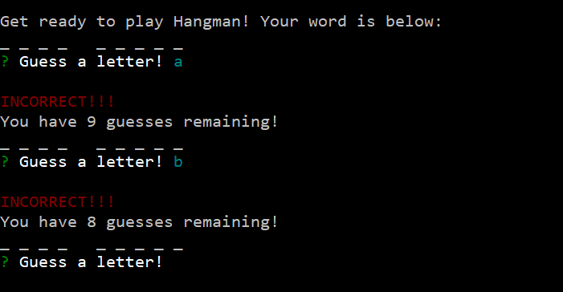

# Constructor_Hangman

# Start of Game
At the start of the game, it provides a blank listing representing a word for the user to start guessing then gives a prompt for the user to put in a guess.

# Incorrect Guess
If the user gives a letter that is incorrect, it will give an incorrect notice and how many guesses remain then prompt for another letter, if the user still has remaining guesses.

# Correct Guess
If the user gives a letter that is correct, it will give a correct statement and show the word again with the letters that have been correctly guessed.

# Correct Word
If the user guesses all the letters, it will confirm the word was completed and then provide a new word to start guessing again.

# Out of Guesses
If the user runs out of guesses before guessing the word, they will be prompted with a message and what the word was. It will then ask if they would like to continue playing. If yes, the game will provide a new word to guess. If no, it will end the game.

# Previously Guessed Letter
If the letter guessed was already used, the game will say state the letter has already been guessed and ask for a new one not already used.
